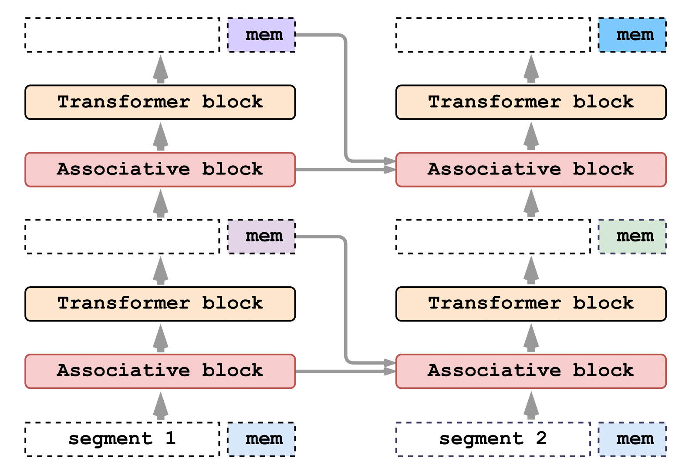

# Beyond Memorization: Extending Reasoning Depth with Recurrence, Memory, and Test Time Compute Scaling


ARMT is a memory-augmented segment-level recurrent Transformer. It scales up to 50M tokens being trained only on 16k. It enhances the original RMT with capacious and flexible associative memory and achieves state-of-the-art scores on BABILong benchmark.

## Dataset

We evaluate the models on the following datasets:

| Dataset | Description | Train size | Val. size | Test size |
| --- | --- | --- | --- | --- |
| 1D Cellular Automata Predicts the next state of a 1D cellular automaton based on its current state | 950,000 | 50,000 | 100,000 |
| 

We implement our memory mechanism with no changes to Transformer model by adding special memory tokens and linear-attention style associative memory. The model is trained to control both memory operations and sequence representations processing.




# Models

We evaluated the following models on our dataset:

1. LSTM
2. Transformer
3. Mamba
4. ARMT

## Installation

Clone the repository to your local machine.

```bash
git clone XXXX
cd XXXX
```

This project requires Python 3.9, PyTorch >= 2.3.1 and CUDA >= 12.1. We recommend using `conda` to create a virtual environment and install the required packages.

```bash
conda create -n <env_name> python=3.9
conda activate <env_name>
conda install nvidia/label/cuda-12.1.0::cuda
pip install -r requirements.txt
```

To run langudge modelling with ARMT with sliding window:

```
cd scripts/pg19
bash finetune_armt_llama3.2_pg19_sliding.sh
```

## Training on cellular automata

To run a training script, navigate to the `scripts` directory, select the folder corresponding to the desired dataset/task, and execute the script for the specific model.

For example, to train the Transformer model with one layer using LACT and without sampling input lengths on the Binary Copy task:

```bash
cd scripts
cd cell_autom
bash finetune_ca_gptneox.sh
```

Please explore script parameters before running.

Other scripts from the paper are located in folders: `cell_autom`, `ca_grpo`, `ca_oo`, `ca_adaptive`.

